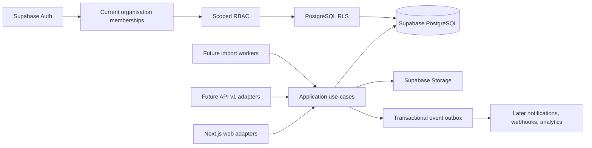

# Platform architecture

## Status and horizon

This document retains the Milestone 1 platform baseline and incorporates the
approved Milestone 3 secure-tenant decisions. Architecture statements do not
claim that application code, schemas, or controls are implemented.

## Target shape

The target is Next.js App Router with strict TypeScript and Supabase Auth, PostgreSQL, and Storage. Future code is organised by business domain under `src/modules/` and shared platform capability under `src/platform/`. Routes, route handlers, and server actions are thin adapters; application use-cases own orchestration and domain transitions.

Mutations normally use the caller-scoped Supabase client so row-level security (RLS) remains effective. Service-role access is reserved for isolated workers or controlled administration, with explicit re-authorisation, audit, and adversarial tests.

See [ADR-0001](../adr/ADR-0001-nextjs-supabase-modular-architecture.md).

## Trust and tenancy

The browser carries a Supabase session. Organisation selection is persisted in
PostgreSQL for that exact session and user; a selected route, browser value, or
JWT organisation/role hint grants nothing. The matching Auth session, active
global identity, active membership, active organisation, scoped permission, and
row `organisation_id` independently authorise every operation. Security events
revoke affected sessions, and tenant access checks require the session row to
remain current. Multi-organisation membership and different selections in
concurrent sessions are native.

Future external APIs and import paths adapt the same use-cases. Database table and PostgREST shapes are not the durable public API.

See [ADR-0002](../adr/ADR-0002-multi-tenant-membership-and-rls.md),
[ADR-0006](../adr/ADR-0006-session-bound-organisation-context.md), and the
[security model](security-model.md).

## Shared capability boundaries

A narrow resource identity registry supports tenant-safe links from shared actions, attachments, comments, schedules, workflow history, Benefits, audit, and events. Typed domain records retain their own fields and lifecycle. Shared action, form, workflow, audit, attachment, and outbox capabilities are distinct; sharing infrastructure does not merge their semantics.

The versioned form engine serves configurable audit/form experiences. Curriculum and structured problem-solving remain typed extensions because their semantics differ. Benefits keeps forecast revisions, validation, financial access, and realisation separate.

These shared capabilities remain later work. Milestone 3 introduces no resource
registry, generic audit, outbox, attachments, templates, actions, Benefits, or
domain workflow. Its narrow append-only security ledger is a bounded tenant
foundation control, not early implementation of the generic audit model.

See [ADR-0003](../adr/ADR-0003-universal-resource-and-shared-capabilities.md) and [ADR-0005](../adr/ADR-0005-universal-versioned-template-engine.md).

See [ADR-0011](../adr/ADR-0011-milestone-3-security-ledger.md) for that bounded
exception.

## Reliability and evolution seams

- Mutating APIs accept stable client-generated idempotency keys where retries are plausible.
- Mutable aggregates use optimistic version columns.
- Important later-domain changes append a transactional outbox event in the
  same transaction once the shared foundation is approved.
- Published template versions, Benefits revisions, transition history, and audit entries are immutable.
- Responsive, touch-first, draft-safe interfaces prepare for later PWA/offline queues; offline synchronisation is deferred.
- Notifications, webhooks, analytics, and cache refresh consume later outbox
  events; neither the outbox nor consumers are Milestone 3 scope.
- N1a introduced the private outbox and delivery ledger. N1b adds the
  `notification-projector` worker that projects supported domain events into
  delivery ledger rows. See [notification projection worker](notification-projection-worker.md).
- Reporting snapshots are deliberate and limited to wording/context that must remain historically true.

## 16-question architectural decision rule

Before accepting a new domain, table, dependency, abstraction, integration, or shared capability, answer all 16 questions. An unanswered or adverse question blocks implementation until the decision is documented.

1. What verified user or operational problem does this solve now?
2. Which approved milestone owns it, and has that milestone been explicitly authorised?
3. Is it an initial foundation fact, architecture-now/implementation-later decision, or speculative idea?
4. Which organisation owns the data, and can ownership ever be ambiguous?
5. How does every read, write, reference, export, and stored object enforce tenant isolation?
6. Which current membership, permission, and unit scope authorise each operation?
7. Can user-controlled metadata, route state, cached claims, or client input influence authorisation?
8. Does the design preserve referential integrity, including cross-tenant reference prevention?
9. Are the semantics genuinely shared, or would a generic abstraction erase domain invariants?
10. What must be immutable, versioned, audited, or snapshotted to preserve historical truth?
11. What sensitive, personal, credential, or financial data exists, and how is exposure minimised?
12. What are the lifecycle, retention, disabling, archival, and deletion behaviours?
13. How do retries, concurrency, partial failure, rollback, and event delivery behave?
14. Which indexes, query patterns, RLS predicates, and growth assumptions must be verified?
15. What abuse cases, privileged paths, monitoring, and adversarial tests prove the boundary?
16. What is the smallest reversible implementation, its acceptance evidence, and its effect on later options?

## Contradictions and risks

- The supplied brief implied existing architecture and audit; this repository was blank, so Milestone 1 establishes rather than migrates the baseline.
- Generic polymorphic IDs simplify early schemas but weaken integrity and RLS; the resource registry resolves shared identity only.
- Configurable workflow labels must not turn into configurable core semantics.
- Fixed hierarchy columns conflict with customer-specific depths.
- Broad Benefit rows could leak financial values through selects, views, exports, or generated APIs.
- Universal soft deletion would damage history or retention semantics.
- Audit evidence, event delivery, and activity presentation cannot safely be one mutable record.
- Entitlements are commercial controls and cannot substitute for tenant security.

## Explicit exclusions

Milestone 1 adds no dependencies, source scaffold, Supabase configuration, SQL, migrations, tenant tables, RLS policies, storage buckets, application routes, or feature implementations. [Milestone 2](milestone-scope-and-acceptance.md#milestone-2-next) is next; Milestone 3+ requires explicit approval.
